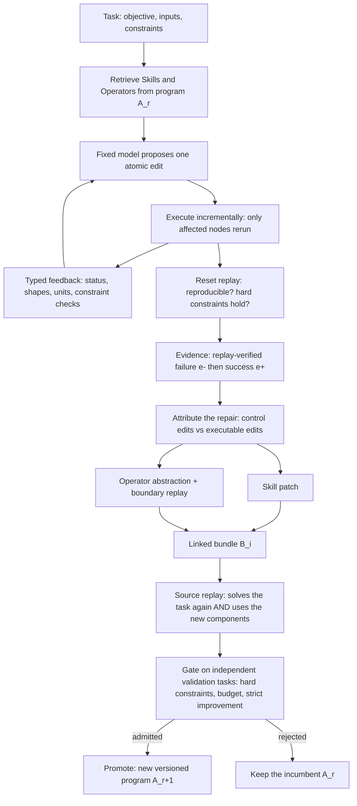

# ScienceClaw

**Verifiable program-level self-evolution for AI-for-Science agents.**

ScienceClaw lets a scientific agent get better at doing science *without training the model*. The agent solves a task as a typed, executable workflow; when a repair is reproduced under a clean replay, it is turned into a linked **Skill** and **Operator**, and it is kept only if it still solves its source task and improves independent validation tasks.

[](LICENSE)
[](https://huggingface.co/datasets/beita6969/scienceclaw-64-samples)


> *ScienceClaw: Benchmarking Continual Self-Evolution of AI-for-Science Agents Across the Natural and Social Sciences* — Mingda Zhang, Wenjin Liu, Tiesunlong Shen, Zikai Xiao, Zhenghong Lin, Qing Xu, Erik Cambria, Xiaoying Tang, Haoran Luo. KDD 2027 manuscript.

This repository is the **agent system**. The companion benchmark, **ScienceClaw-Eval**, is released separately and its evaluation data lives on [Hugging Face](https://huggingface.co/datasets/beita6969/scienceclaw-64-samples) (see [ScienceClaw-Eval](#scienceclaw-eval-the-companion-benchmark)). The system is built on the [OpenClaw](https://github.com/openclaw/openclaw) gateway.

---

## The problem

LLM agents increasingly solve scientific tasks by connecting reasoning to data, domain tools and executable code. But a repair that works once rarely survives: it lives in a transient context, or in a single tool or prompt. Existing work evolves individual tools or Skills, and existing benchmarks treat tasks as independent episodes, so it has been hard to tell whether verified scientific executions turn into *persistent, transferable* improvements.

> **How can verified scientific executions drive persistent and transferable program-level self-evolution without updating foundation-model parameters?**

## What is new

**1. A task for program-level self-evolution.** The model Θ₀ is fixed. What evolves is an editable program `A_r = (Skills, Operators)`: Skills carry strategy (decomposition, workflow construction, recovery), Operators are typed, executable capabilities with explicit input, output and domain contracts. A task `D_t = (D_T, D_V, D_E)` specifies its objective and inputs, its evaluation protocol and hard constraints (units, feasibility, convergence, reproducibility), and its data, tools and environment.

**2. Typed, execution-guided workflows.** A solution is a directed graph whose ports carry a schema `(type, shape, unit, provenance)`; an edge is valid only if types and shapes match and any unit conversion is explicit and recorded. The agent edits the graph one atomic action at a time; the executor checkpoints every node by fingerprint and reruns only the affected descendants, so a long scientific workflow is repaired rather than regenerated.

**3. Evidence you can replay.** Every candidate result is regenerated from a *reset* environment and checked against the task's evaluator and hard constraints. A replay that fails and a later replay that passes bracket the shortest reproduced repair, `e⁻ → e⁺`. Replay alone never authorizes persistence.

**4. Linked Skill–Operator candidates, with no LLM judge.** The reproduced repair is split by edit type: control edits (topology, routing, configuration) become a **Skill patch**; generated or repaired executable nodes are grouped into convex components and abstracted into typed **Operators**, each checked by *boundary replay* in isolation. Both are committed as one atomic bundle, so a strategy never arrives without the capability behind it, nor a capability without a strategy that selects it. Forming, ranking and selecting candidates needs no auxiliary LLM judge.

**5. A replay-and-validation gate.** A candidate persists only if
- **source replay** reproduces the repair and actually *uses* every new component (`R_src = Pass ∧ Use`),
- every hard integrity and scientific check holds on independent validation tasks,
- its cost stays within budget, and
- it **strictly improves** the validation score over the incumbent (with a noise guard: at least two improved and at most one regressed validation episode).

Otherwise the incumbent program is kept. Updates are versioned, can be rolled back, and in the gateway they are promoted by the user.

**6. A benchmark built for accumulation.** ScienceClaw-Eval measures scientific correctness, evolutionary gain, retention, cross-dataset transfer and evolution cost over sequential task streams in 23 disciplines, with independent reset evaluation.



## Results at a glance

All numbers are from the paper's protocol: seven evolution rounds over the common 23-discipline source streams, 64 IID and 64 OOD instances per discipline, one fixed foundation model shared by every system, and the same tools, source stream, validation data and update budget for every baseline. OOD means an independently sourced dataset of the same discipline; OOD results never generate or select updates.

| System (what it evolves) | Mean OOD gain over the frozen agent |
| --- | ---: |
| SkillOpt (Skills) | 5.74 % |
| TTE (tools at test time) | 8.82 % |
| AHE (agent harness) | 9.73 % |
| EvoScientist (programs and memory) | 10.55 % |
| EvoMaster (programs and memory) | 11.95 % |
| **ScienceClaw (linked Skill–Operator program)** | **16.45 %** |

- **Best in all 23 disciplines on both IID and OOD.** The mean relative margin over the strongest baseline grows from 2.58 % (IID) to 4.19 % (OOD). The OOD score falls 11.73 % below IID on average, against 16.06 % for the frozen agent and 13.46–15.45 % for the baselines.
- **Keeps improving over rounds.** The OOD macro success rate rises from 77.83 at the initial program to 91.30 after round 7 (+13.47 pp, against +9.64 pp for the strongest baseline). 70 of 161 submitted candidates are promoted (43.48 %), so the gate is selective without stalling.
- **Transfers and retains.** 18 of 20 cross-family pairs transfer positively (mean +1.57 pp; +14.68 pp within a family). Average forgetting is 0.13 pp (maximum 0.51 pp), with 11.89 % negative transfer.
- **The linkage and the gate are what matter.** Committing Skills and Operators separately keeps only 60 % of the gain; Skill-only and Operator-only evolution keep 40 % and 57 %. Without independent IID selection only 15 % of the gain remains; without scientific constraints, source replay, or the independent validator, 46 %, 55 % and 59 %.
- **Reliable and cheap.** Hard constraints pass on 98.23 % of instances, only 1.23 % of promotions are erroneous (3.80–7.24 % for the baselines), and each OOD point costs less than for every other method.
- **Execution structure is the base.** The full system runs 4.84 planner rounds and 4.24 distinct Operators per task, repairs 71 % of failures from feedback, recovers 89 % after interruption and replays 96 % cleanly (a single-turn agent: 0 %, 31 %, 78 %).

Reported trajectories are final snapshots, not uncertainty estimates over source orders or model configurations, and cost comparisons are relative to the protocol, not absolute. See the paper for the full tables, ablations and the limitations discussion.

## From the paper to this repository

| Paper | Code (`packages/scienceclaw/`) |
| --- | --- |
| Task `D_t = (D_T, D_V, D_E)` | `scienceclaw/task.py` (`Episode`); a live task declaration becomes one in `canvas/live.py` |
| Program `A_r = (Skills, Operators)` | `core/program.py`, versioned by `program/store.py`; seed Skills from `skills/scienceclaw-*` (`program/seed.py`); 112 typed library Operators in `program/specs/` |
| Typed workflow graph, `Compat` | `core/schema.py`, `core/graph.py`, `core/actions.py` |
| Execution-guided orchestration | `agent/` (policy, prompts, solver) and `canvas/session.py`, where the gateway agent is the policy |
| Checkpointed execution, reset replay | `runtime/executor.py`, `runtime/replay.py` |
| Sandbox and integrity | `runtime/sandbox.py`, `runtime/integrity.py`, `runtime/node_worker.py` |
| Retrieval of Skills and Operators | `core/retrieval.py` (BM25 plus metadata match) |
| Repair attribution, edit split | `evolution/attribution.py`, `evolution/split.py` |
| Skill patch, Operator abstraction, boundary replay | `evolution/skill_patch.py`, `evolution/operator_abstraction.py` |
| Linked bundle, source-replay check, gate | `evolution/bundle.py`, `evolution/validation.py` |
| Strict-improvement update | `evolution/evolver.py` (batch), `evolution/live.py` (gateway, user-promoted) |
| Scientific tools | `scilib/` (42 modules), a catalog of 292 tool functions, 28 pretrained-weight assets (`scienceclaw/tools/weights.json`) |
| Gateway integration | `extensions/scienceclaw/` plugin and `python -m scienceclaw.rpc` |

The full contract, including the decisions the paper leaves open, is in [`packages/scienceclaw/docs/DESIGN.md`](packages/scienceclaw/docs/DESIGN.md); the gateway, plugin, skill and evolution map is in [`packages/scienceclaw/docs/INTEGRATION.md`](packages/scienceclaw/docs/INTEGRATION.md).

## Quick start

```bash
git clone https://github.com/beita6969/ScienceClaw.git
cd ScienceClaw

# One-click setup: Node, Python, the engine, its tools and weights, MCP servers, skills
chmod +x setup.sh && ./setup.sh

# Or manually
pnpm install && npx openclaw onboard
pip install -e packages/scienceclaw          # Python >= 3.11; extras: [all], vision, audio, nlp, forecast, materials, retrieval
python -m scienceclaw.cli setup              # install and verify every tool and pretrained weight (--profile light skips assets > 1.5 GB)
python -m scienceclaw.cli doctor             # which tool modules can run on this machine, and why not
```

The engine refuses tasks until `setup` has completed (`SCIENCECLAW_SKIP_SETUP_CHECK=1` is for development only), and the full profile downloads about 19 GB of weights. `setup.sh` runs it for you; `SCIENCECLAW_SKIP_TOOLS=1` defers it to first use.

### Bring your own model

The engine never assumes a model family and the repository names none. Point it at any OpenAI-compatible endpoint, a local program, or your own backend:

```bash
export SCIENCECLAW_API_BASE_URL=<your OpenAI-compatible endpoint>
export SCIENCECLAW_API_KEY=<your key>
export SCIENCECLAW_MODEL=<your model name>      # or SCIENCECLAW_<POLICY|EXECUTOR|PATCH>_MODEL per role
```

`llm.backend` can also be `command` (a local program reads the prompt and writes the completion) or `package.module:factory`. Without a model the engine says `no model configured for role 'policy'`. See [`configs/default.yaml`](packages/scienceclaw/configs/default.yaml).

### Use it from the gateway

Enable the plugin in `~/.openclaw/openclaw.json` (see [`extensions/scienceclaw/README.md`](extensions/scienceclaw/README.md)); it registers four agent tools:

| Tool | Operations |
| --- | --- |
| `scienceclaw_canvas` | `open`, `act`, `render`, `replay`, `finish`, `status`, `list` |
| `scienceclaw_tools` | `search`, `show`, `status`, `weights`, `setup` |
| `scienceclaw_program` | `summary`, `skills`, `operators`, `show`, `history`, `rollback` |
| `scienceclaw_evolve` | `val_add`, `val_list`, `val_remove`, `propose`, `gate`, `run`, `status`, `candidates`, `show` |

A session, end to end:

1. **Declare the task.** `scienceclaw_canvas(operation=open, task={objective, inputs, required_output, constraints})`. Each input becomes a read-only `load_<name>` tool restricted to the configured input roots; constraints (`finite`, `shape`, `type`, `range`, `nonempty`, `len_eq_input`, or an evaluator-only `metric` bar) are the acceptance test.
2. **Build the workflow.** The agent finds tools with `scienceclaw_tools`, then adds, modifies or removes one node or edge per `act`, reading the typed feedback after each edit.
3. **Verify.** `replay` re-executes the whole graph from a reset state; `finish` returns the verified deliverable.
4. **Evolve (optional).** Register independent validation tasks with `val_add` (the default noise guard needs at least two), then `propose` candidates from a finished, verified session and `gate` them. A session that contained a repair yields a linked Skill and Operator; one without a failed replay yields an Operator only. A candidate that passes becomes `ready`.
5. **You decide.** Review and promote with the CLI; every promotion is a new program version that can be rolled back:

```bash
python -m scienceclaw.cli live candidates
python -m scienceclaw.cli live show <candidate>
python -m scienceclaw.cli live promote <candidate>
python -m scienceclaw.cli live rollback <version>
```

The same engine speaks line-delimited JSON on `python -m scienceclaw.rpc` if you want to drive it from your own host.

## Skills and tools

- **Over 300 skills** live in [`skills/`](skills). The 36 `scienceclaw-*` skills form the seed program: 12 general ones (canvas orchestration, evolution, and task patterns such as retrieval, prediction and verification) and the discipline skills below. Evolved Skills are written back as versioned records of the same program.
- **Discipline skills** (`scienceclaw-benchmark-for30` … `for52`, indexed by `scienceclaw-benchmark`) describe the task family of each benchmark discipline: inputs, deliverable, how quality is judged, and the `scilib` tools and weights that fit. They are seed Skills like the others and are retrieved when a task matches.
- **`scilib`** wraps classical toolkits and frozen pretrained models for science: forecasting, segmentation, source separation, protein and molecular models, causal inference, parsing, formal solvers and more. Heavy models run on a GPU-tool broker when they cannot run locally. `scienceclaw_tools` and `python -m scienceclaw.cli tools` search, describe and probe them.
- **Research protocol.** [`SCIENCE.md`](SCIENCE.md) governs literature work in the gateway: every citation must come from a tool result in the current conversation, searches cross several sources, and results are written to a file before an answer is final.

## Safety and governance

Persistent executable updates can reuse errors and widen the attack surface, so the design is conservative:

- **The model is never updated.** `Θ_{r+1} = Θ_r = Θ₀`.
- **Nothing persists without evidence.** Source replay, validation, budget and strict improvement all have to hold; the gate fails closed when the model is unavailable.
- **Updates are the user's decision, and reversible.** Candidates wait as `ready` until promoted; every version is a snapshot with a receipt and can be rolled back.
- **Code runs in a sandbox.** Code nodes run in a separate process with a scrubbed environment, a static scan of the code, a runtime audit guard on protected data and engine state, and user/network/pid namespaces where the host supports them. Run untrusted workloads in a container as well.
- **Provenance everywhere.** Ports record units and upstream transformations; operators record their source episode, steps and parent version.

ScienceClaw should support, not replace, experts. High-stakes use needs provenance, licensing and privacy safeguards, and independent review.

## ScienceClaw-Eval: the companion benchmark

ScienceClaw-Eval benchmarks continual self-evolution rather than single-shot ability. Systems share the foundation model, the initial program, the source order, the tools and the budget, and are compared on:

- a **source stream** that supplies the only evolution evidence,
- an independent **validation set** used for candidate selection,
- held-out **ID** and same-discipline cross-dataset **OOD** sets,
- a **replay** set of earlier source tasks that measures retention.

An instance counts as solved only if execution completes within budget, the task-native metric meets its acceptance rule, and every scientific hard constraint holds; success is macro-averaged over disciplines. Each task has an isolated environment and a task-specific evaluator, reviewed by domain experts and verified by reset replay.

The evaluation data (64 IID and 64 OOD records for each discipline) is on Hugging Face: **[`beita6969/scienceclaw-64-samples`](https://huggingface.co/datasets/beita6969/scienceclaw-64-samples)**. This repository does not contain the data, an evaluation harness, or its tests.

| Code | Discipline (ANZSRC division) | Task | Metric |
| --- | --- | --- | --- |
| FoR30 | Agricultural, veterinary and food sciences | plant and leaf panoptic segmentation | PQ+ ↑ |
| FoR31 | Biological sciences | protein variant fitness ranking | Spearman ↑ |
| FoR32 | Biomedical and clinical sciences | hippocampus segmentation in MRI | DSC ↑ |
| FoR33 | Built environment and design | building load forecasting | NRMSE (%) ↓ |
| FoR34 | Chemical sciences | molecular activity classification | ROC-AUC ↑ |
| FoR35 | Commerce, management, tourism and services | tourism series forecasting | MASE ↓ |
| FoR36 | Creative arts and writing | music source separation | SDR (dB) ↑ |
| FoR37 | Earth sciences | 2 m temperature forecasting | RMSE (K) ↓ |
| FoR38 | Economics | macroeconomic forecasting | sMAPE (%) ↓ |
| FoR39 | Education | adaptive educational testing | 10-mask accuracy ↑ |
| FoR40 | Engineering | anomalous sound detection | DCASE score ↑ |
| FoR41 | Environmental sciences | probabilistic aquatic forecasting | CRPS ↓ |
| FoR42 | Health sciences | sepsis early warning | clinical utility ↑ |
| FoR43 | History, heritage and archaeology | OCR post-correction | cMER-micro ↓ |
| FoR44 | Human society | causal treatment-effect estimation | nRMSE ↓ |
| FoR45 | Indigenous studies | Indigenous-language captioning | chrF++ ↑ |
| FoR46 | Information and computing sciences | code generation | pass@1 ↑ |
| FoR47 | Language, communication and culture | dependency parsing | LAS ↑ |
| FoR48 | Law and legal studies | contract evidence retrieval | mAP ↑ |
| FoR49 | Mathematical sciences | SMT satisfiability prediction | oracle-agreement accuracy ↑ |
| FoR50 | Philosophy and religious studies | human-value detection | F1 ↑ |
| FoR51 | Physical sciences | phonon property prediction | MAE ↓ |
| FoR52 | Psychology | human choice prediction | micro accuracy ↑ |

## Project structure

```
ScienceClaw/
├── packages/scienceclaw/    # the engine: typed workflows, runtime, Skill/Operator program, evolution, tool library
│   ├── scienceclaw/         #   core, runtime, agent, canvas, program, evolution, llm, tools, rpc, cli
│   ├── scilib/              #   42 scientific tool modules
│   ├── configs/             #   default run configuration (no model, no paths)
│   ├── scripts/             #   LLM serving, GPU-tool broker and environment scripts
│   └── docs/                #   DESIGN.md (the contract) and INTEGRATION.md
├── extensions/scienceclaw/  # gateway plugin: canvas, tools, program, evolve
├── skills/                  # 300+ skills, including the seed program and the 23 discipline skills
├── mcp-servers/             # arXiv-LaTeX and ChEMBL MCP servers
├── SCIENCE.md               # research protocol for the gateway agent
├── setup.sh                 # one-click setup
├── src/, ui/, apps/, ...    # the OpenClaw gateway, web UI and apps
└── docs/                    # gateway documentation
```

## Citation

```bibtex
@misc{zhang2027scienceclaw,
  title  = {ScienceClaw: Benchmarking Continual Self-Evolution of AI-for-Science Agents Across the Natural and Social Sciences},
  author = {Zhang, Mingda and Liu, Wenjin and Shen, Tiesunlong and Xiao, Zikai and Lin, Zhenghong and Xu, Qing and Cambria, Erik and Tang, Xiaoying and Luo, Haoran},
  year   = {2027},
  note   = {KDD 2027 manuscript}
}
```

## Contact

mingdazhang@ieee.org

## License

MIT — see [LICENSE](LICENSE).
