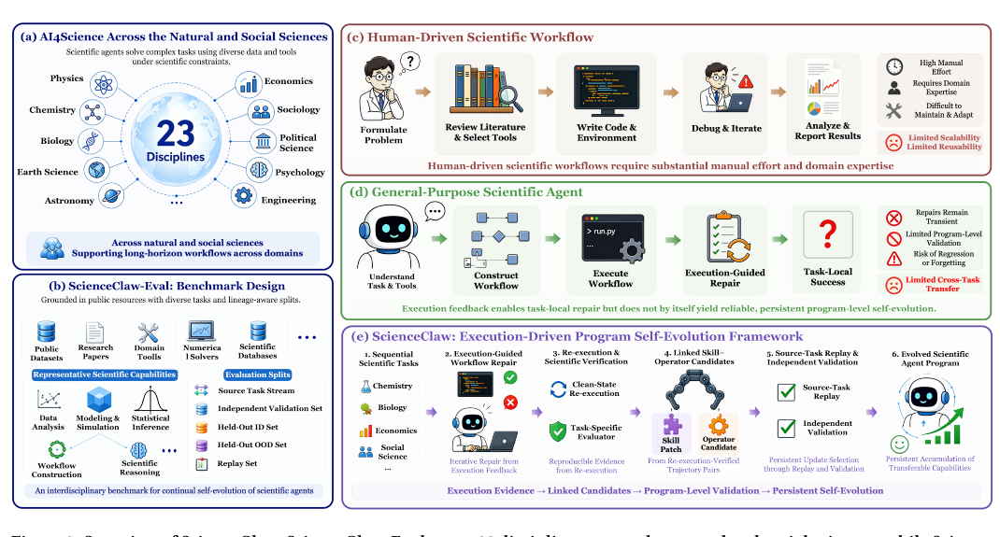
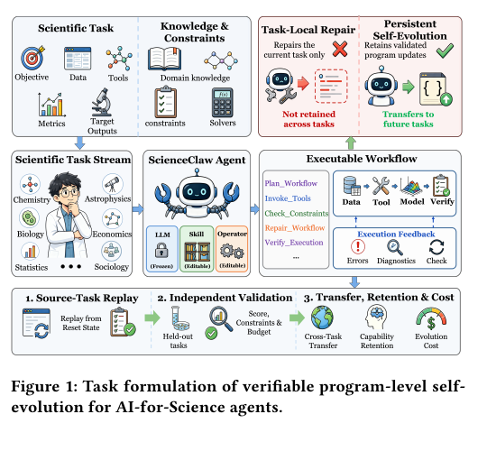
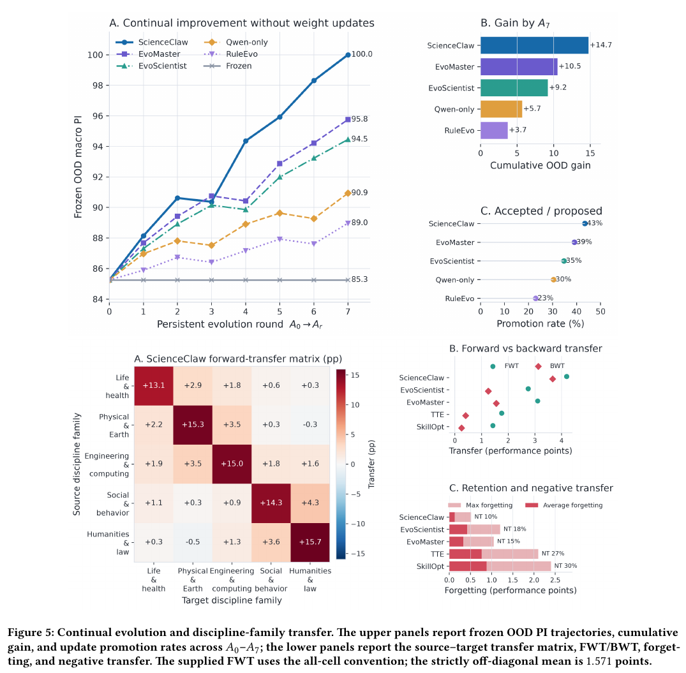
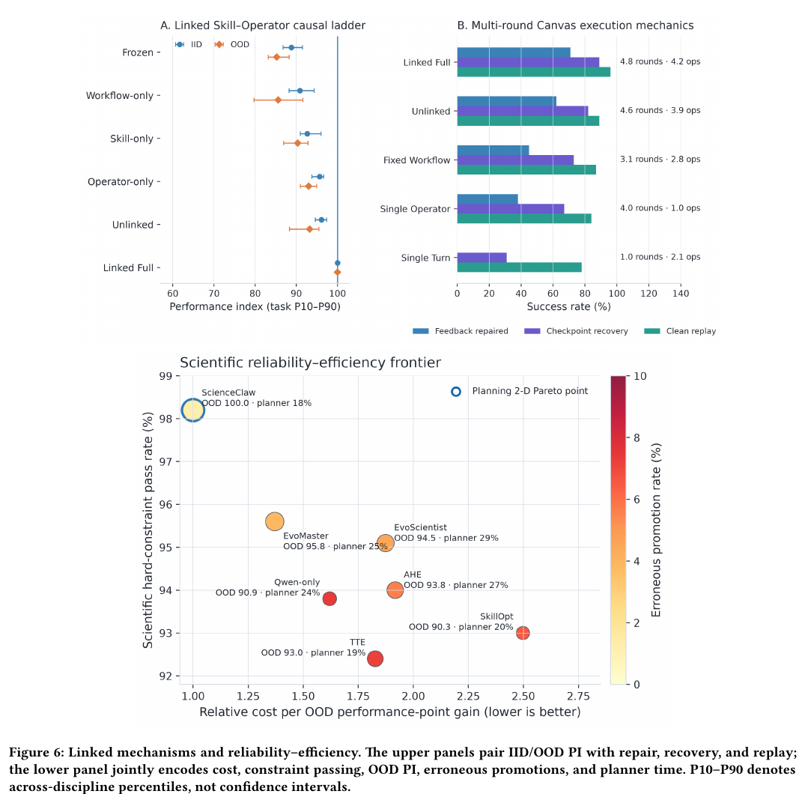
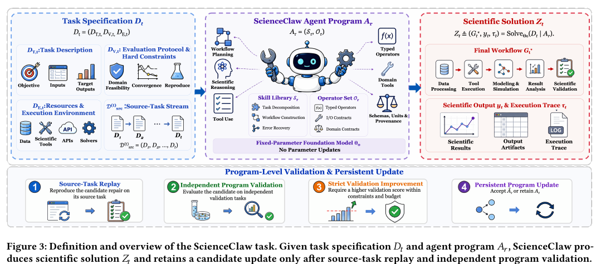
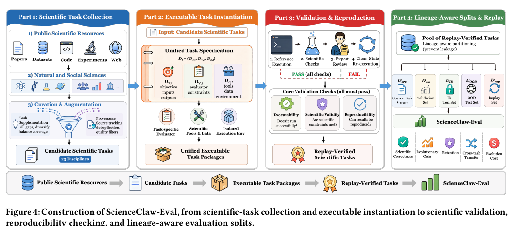

# ScienceClaw

ScienceClaw is a framework for **verifiable, continual self-evolution of
AI-for-Science agents**. It studies a simple question: when a scientific agent
repairs a workflow successfully, how can that verified execution become a
reusable program improvement instead of disappearing with the episode?

The paper keeps the foundation-model parameters fixed. The editable program is
made of **Skills** for decomposition, workflow construction, and recovery, plus
typed **Operators** with explicit inputs, outputs, units, schemas, and domain
contracts. A repair is retained only when it survives reset replay on its source
task, satisfies scientific and resource constraints, and strictly improves
independent validation tasks.

<p align="center">
  
</p>

## What the paper contributes

ScienceClaw combines three pieces that are usually evaluated separately:

1. **Execution-guided workflow repair.** The agent constructs a typed workflow,
   executes it against data and domain tools, observes errors and diagnostics,
   and repairs only the affected part of the graph.
2. **Program-level self-evolution.** A replay-verified failure-to-success trace
   is converted into linked Skill and Operator candidates. The candidate is
   versioned and applied atomically; a successful live episode alone is not
   enough to change the program.
3. **Independent scientific evaluation.** ScienceClaw-Eval covers 23 natural
   and social-science disciplines. Source streams provide evolution evidence;
   independent validation, ID, OOD, and replay splits measure correctness,
   evolutionary gain, retention, cross-dataset transfer, and evolution cost.

<p align="center">
  
</p>

The update rule is deliberately conservative: source-task replay must reproduce
the repair, hard scientific checks must pass, resource budgets must hold, and
the complete program must improve on held-out validation tasks. Otherwise the
incumbent program is kept.

## Evidence reported in the paper

On the paper's 23-discipline evaluation, the final ScienceClaw snapshot reaches
an average OOD rank of **1.000**. OOD program integrity rises from **85.252** at
A0 to **100.000** at A7 (**+14.748 points**); 70 of 161 candidates are promoted
(43.5%), and 18 of 20 off-diagonal transfer pairs are positive. The full
mechanism reports 71% repair, 89% recovery, 96% replay, 98.2%
scientific-constraint passing, 1.2% erroneous promotions, and normalized cost
1.000. These numbers belong to the paper's fixed protocol and should not be
confused with a local smoke run or with a different dataset delivery.

<p align="center">
  
</p>

<p align="center">
  
</p>

## How the system is organized

The repository is a deployable research system, while the paper method remains
the center of the design:

| Layer | Role |
| --- | --- |
| `skills/` | General research skills, the benchmark router, 23 dataset-specific skills, and the self-evolution contract |
| `packages/scienceclaw-bench/scienceclaw/` | Typed task graphs, replay, evaluators, receipts, validation, and candidate promotion |
| `packages/scienceclaw-bench/scilib/` | Reusable domain operators and frozen pretrained wrappers |
| `packages/scienceclaw-bench/benchctl.py` | Native bridge for catalog, task inventory, offline TOY smoke, and reports |
| `extensions/scienceclaw-bench/` | OpenClaw plugin boundary; credentials and arbitrary shell access stay outside the bridge |
| `packages/scienceclaw-bench/scripts/` | Local and Leonardo launchers for explicit server-side benchmark runs |
| `assets/paper/` | Figures extracted from the ScienceClaw manuscript |

The current catalog exposes 23 registered disciplines, 45 registered domain
tools, 17 runnable configurations, and 56 server/benchmark scripts. The catalog
only reports registered routes, so experimental task modules cannot silently
appear as advertised capabilities.

<p align="center">
  
</p>

## Installation

The gateway and benchmark package can be installed independently.

```bash
git clone https://github.com/beita6969/ScienceClaw.git
cd ScienceClaw

# Gateway
pnpm install
npx openclaw onboard

# Benchmark engine and lightweight operators
python3 -m venv .venv
source .venv/bin/activate
python -m pip install -e packages/scienceclaw-bench

# Add only the domain stacks needed by the host, or use [all] on a prepared GPU image.
python -m pip install -e 'packages/scienceclaw-bench[vision,audio,nlp,forecast,materials,retrieval]'
```

## Datasets, weights, and server deployment

Datasets and model weights are intentionally **not stored in GitHub**. Place
the Hugging Face dataset delivery and frozen weights on the execution host,
then set the roots before running a benchmark:

```bash
export SCIENCECLAW_DATA_ROOT=/srv/scienceclaw/datasets
export SCIENCECLAW_MODELS=/srv/scienceclaw/models
```

`SCIENCECLAW_DATA_ROOT` must contain the adapter-specific directory layout;
`SCIENCECLAW_MODELS` is used by pretrained operators and Leonardo launchers.
The checked-in YAML files contain no machine-specific path. Leonardo jobs also
export these variables so local tools, the sandbox, and remote workers resolve
the same assets.

To inspect the registered routes without loading a dataset:

```bash
PYTHONPATH=packages/scienceclaw-bench \
  python packages/scienceclaw-bench/benchctl.py <<'JSON'
{"op":"catalog"}
JSON
```

Formal ID/OOD evaluation remains a server-side operation. The bridge's `smoke`
operation is an offline TOY wiring check; it is not a benchmark score.

<p align="center">
  
</p>

## Self-evolution contract

The implementation follows the paper's evidence order:

```text
source execution
  -> reset replay of the repair
  -> visible validation and hard scientific checks
  -> budget and reproducibility gates
  -> strict program-level improvement
  -> versioned Skill–Operator update
```

Hidden ID/OOD targets never select tools, write skills, or choose an update.
External weights are treated as frozen assets, with their provenance and
license recorded in the deployment environment.

## Paper

**ScienceClaw: Benchmarking Continual Self-Evolution of AI-for-Science Agents
Across the Natural and Social Sciences.** Mingda Zhang, Wenjin Liu, Tiesunlong
Shen, Zikai Xiao, Zhenghong Lin, Qing Xu, Erik Cambria, Xiaoying Tang, and
Haoran Luo. KDD 2027 manuscript.

The paper figures in `assets/paper/` are included for project documentation;
the manuscript and datasets remain maintained separately from the code
repository.

## License

MIT. See [LICENSE](LICENSE).
